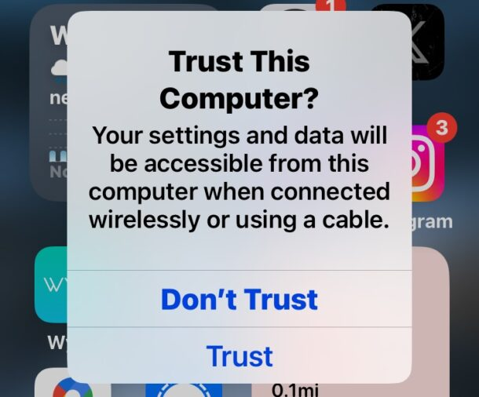
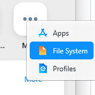
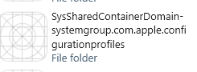
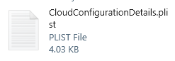
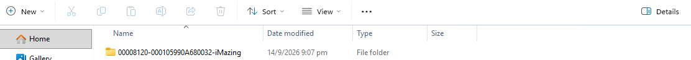

# MDM BYPASS METHOD
**method tested by me**

## what is needed 
- a computer with windows 10/11 installed
- data cable 
- itunes and imazing
- connecting to itunes not disabled by admin
- enough patience

----------------------------------------------------------------------------------------------------------------------------------------------------------
# first
check that you have installed the following things
- `itunes`
- `imazing`

after checking that you have those things 
- plug your data cable into your computer
- open your ipad to home screen and you should see a "trust device" prompt

- once done open up imazing
- of you get a "thank you for choosing imazing" popup click the `use in trial mode`
- enter the `devices` page you should see you device click your ipad/phone
- click on `tools selection` and click `back up` and `create a editable copy of this backup`

----------------------------------------------------------------------------------------------------------------------------------------------------------
 
# second

- open your editable backup it should be grey
- at the far top right of the page click `more` and a page should apear click `file systems` 
    - at the `file systems` naviagate to `system shared containers` then enter `SysSharedContainerDomain-systemgroup.com.apple` then `libary` then `ConfigurationProfiles`
    
     
    
        - at the `configurationProfile` delete `MDM.plist`,`MDMEvents.plist`, & `CloudConfigurationDetails.plist` 
        * if MDMEvents.plist cannot be found ingore it

- save 
- head back to home page by pressing the `ipad or your device name`

    - press `tools` at the left side 
    - press `export backup as folder ` and scroll till you find `export backup as a folder`

        - click `Downloads` at the file explorer popup and press `save`
        
----------------------------------------------------------------------------------------------------------------------------------------------------------
 
# third

- open `itunes` and `file explorer`
- open one more `file explorer`
- on one of the `file explorer` app, click the top bar, the word home should be higlighted,press `backspace` on the keyboard and paste in
    
    - `C:\Users\YourName\Apple\MobileSync\Backup` change `YourName` to the name of your computer that you set as
    - when your at the page you should see a backup file already in
        - If `C:\Users\YourName\Apple\MobileSync\Backup` does not exsist replace it with `C:\Users\YourName\AppData\Roaming\Apple Computer\MobileSync\Backup`
     
        - drag that backup to somewhere like `downloads` and rename to `backup-normal` 
            - editing name is not compolsory 
            - on your second `file explorer` put both side by side and drag the edited backup into the backup page
                - save
    

----------------------------------------------------------------------------------------------------------------------------------------------------------

# LASTLY

- reopen `itunes` and check `restore backup` while your ipad is connected 
    - your ipad should restart and load that config

----------------------------------------------------------------------------------------------------------------------------------------------------------

# EXTRAS

- TESTED DEVICES
    - IPAD A16 IOS 26

- IF YOU ARE IN SINGAPORE MDM AND CANNOT CONNECT OR DO NOT GET `TRUST DEVICE POPUP` ASK YOUR TEACHER ON HOW TO CHANGE YOUR OPTION, IDEALY `B` YOU MAY NEED YOUR PARENTS SINGPASS TO LOGIN AND CHANGE IT
    - IF YOU STILL CANNOT THIS METHOD WILL NOT WORK
    - CHECK IN RESTRICTIONS IF `PARING WITH ITUNES DISABLED` IS IN YOUR RESTRICTIONS
 

# THANKS
   
 - I WOULD LIKE TO THANK `valnoxy` ON GITHUB FOR PARTIALLY GIVING THE METHOD

# DONATIONS

- im broke pls donate
  - `https://buymeacoffee.com/kaitanrji`
